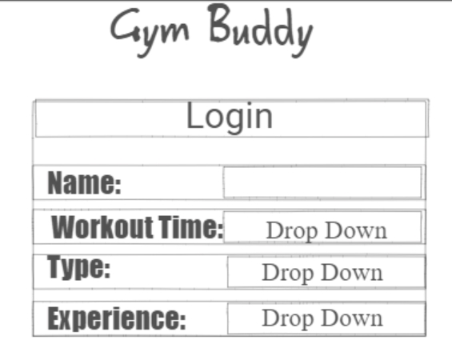
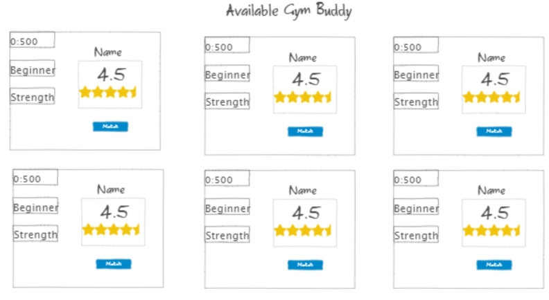
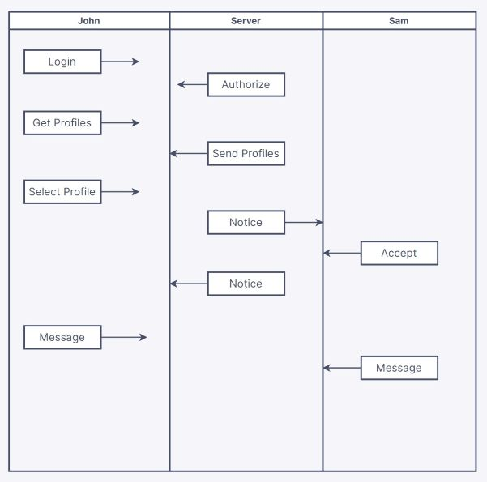

# Gym Buddy

## Description deliverable

### Elevator Pitch
Did you know that working out with a partner can increase your motivation, performance, and accountability? The Gym Buddy app connects you with compatible workout partners in your area. With Gym Buddy, you can create your profile, set your preferences, and browse through potential matches based on time of day, type of training, and experience level. Gym Buddy helps you find your perfect workout soul mate, who will motivate you, challenge you, and support you through your fitness journey. If you’re ready to take your workouts to the next level and find your ideal gym partner, use Gym Buddy today!

### Design
Here is a rough mockup for the login/account creation:

Here we have a rough mockup of what the main page might look like while reviewing profiles. I may add a functionality to write a short description of yourself later. You can see other users can leave you a rating after a workout:

Here is a mockup of how the application data would be stored and sent:

### Key Features
- Secure Login.
- Ability to view and interact with other user's profiles.
- Ability to change user preferences after account creation.
- Receiving notice when the user profile is selected.
- Ability for two users to send short messages to one another.
- Can leave an "out of 5 review" on other profiles after match.

### Technologies

**Use of Technologies:**
- **HTML** - I will have three HTML pages. One for login, one for viewing profiles, and one for interacting with a match.
- **CSS** - Styling the application in a clean and user-friendly way. No overuse of contrasting colors or flashy visuals.
- **Javascript** - Login support, selecting profiles, display user ratings.
- **Service** - Backend service endpoint:
  - login
  - retrieving profiles
  - submitting match select
  - retrieving match status
  - sending/retrieving messages
- **DataBase** - Store user profiles, matches, and messages.
- **Login** - Log in and create profile. Profile needed to view or interact with other users.
- **WebSocket** - Generate real-time reviews and send chat between users.
- **React** - Application to follow framework.
