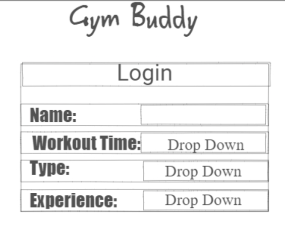
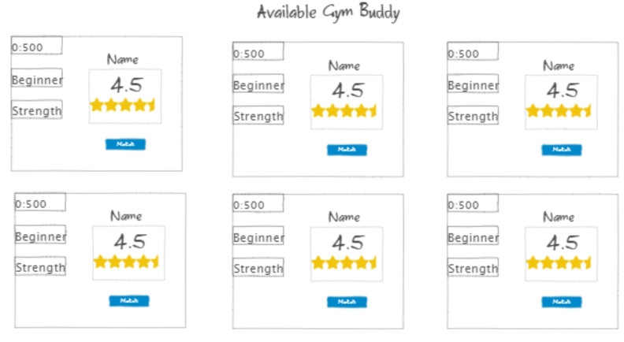
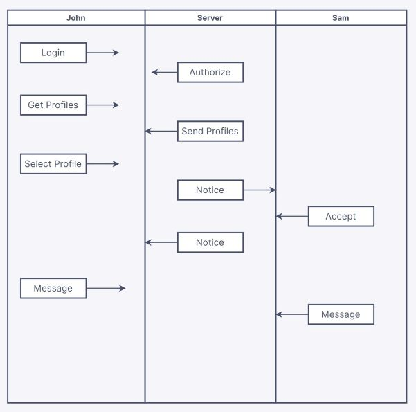

# Gym Buddy

## Description deliverable

### Elevator Pitch
Did you know that working out with a partner can increase your motivation, performance, and accountability? The Gym Buddy app connects you with compatible workout partners in your area. With Gym Buddy, you can create your profile, set your preferences, and browse through potential matches based on time of day, type of training, and experience level. Gym Buddy helps you find your perfect workout soul mate, who will motivate you, challenge you, and support you through your fitness journey. If you’re ready to take your workouts to the next level and find your ideal gym partner, use Gym Buddy today!

### Design
Here is a rough mockup for the login/account creation:

Here we have a rough mockup of what the main page might look like while reviewing profiles. I may add a functionality to write a short description of yourself later. You can see other users can leave you a rating after a workout:

Here is a mockup of how the application data would be stored and sent:

### Key Features
- Secure Login.
- Ability to view and interact with other user's profiles.
- Ability to change user preferences after account creation.
- Receiving notice when the user profile is selected.
- Ability for two users to send short messages to one another.
- Can leave an "out of 5 review" on other profiles after match.

### Technologies

**Use of Technologies:**
- **HTML** - I will have three HTML pages. One for login, one for viewing profiles, and one for interacting with a match.
- **CSS** - Styling the application in a clean and user-friendly way. No overuse of contrasting colors or flashy visuals.
- **Javascript** - Login support, selecting profiles, display user ratings.
- **Service** - Backend service endpoint:
  - login
  - retrieving profiles
  - submitting match select
  - retrieving match status
  - sending/retrieving messages
- **DataBase** - Store user profiles, matches, and messages.
- **Login** - Log in and create profile. Profile needed to view or interact with other users.
- **WebSocket** - Generate real-time reviews and send chat between users.
- **React** - Application to follow framework.

### HTML Deliverable
- **HTML Pages** -- Added four HTML pages that allow account creation, login, viewing other users, and messaging.
- **Links** -- Account creation button and login button both directly link to the user page. Nav menue present throughout all pages.
- **Textual Content** -- Profiles are described by textual content. All buttons and links are described as well.
- **3rd Party Service Calls** -- Added a placeholder for directly searching Google Maps for near by gyms on the homepage. May later update to include trails or other outdoor activities.
- **Application Images** -- Added a placeholder image for profiles on the messaging page. Not a lot of images will be present on the actual page.
- **Login** -- Created a login page and a account creation page. User name displayed at top of each page other than account creation.
- **Database** -- User page is a placeholder for all account information storage and viewing. Message page also stores information.
- **Websocket** -- Real time updates will be displayed on the Message page, allowing users to communicate with one another.
- **Git Commits** -- Every major update is documented upon commit.

### CSS Deliverable
- **Header/Footer Main Content** -- Made a consistent sytle for both footer and header on all pages.
- **Navigation Elements** -- A nav bar is attached to the header on all pages. Styled to match website theme.
- **Window Resizing** -- All elements resize for each browser window and device. Tested with developer tools.
- **Application Elements** -- Used a background image as white space and created a consistent theme throughout each element.
- **Text Content** -- All fonts match for individual elements and uses.
- **Application Images** -- Used an open source image for the application background. Styled each profile picture to be cropped in a round circle on the message page.
- **Git Commits** -- Several git commits and comments were made during the css styling process.

